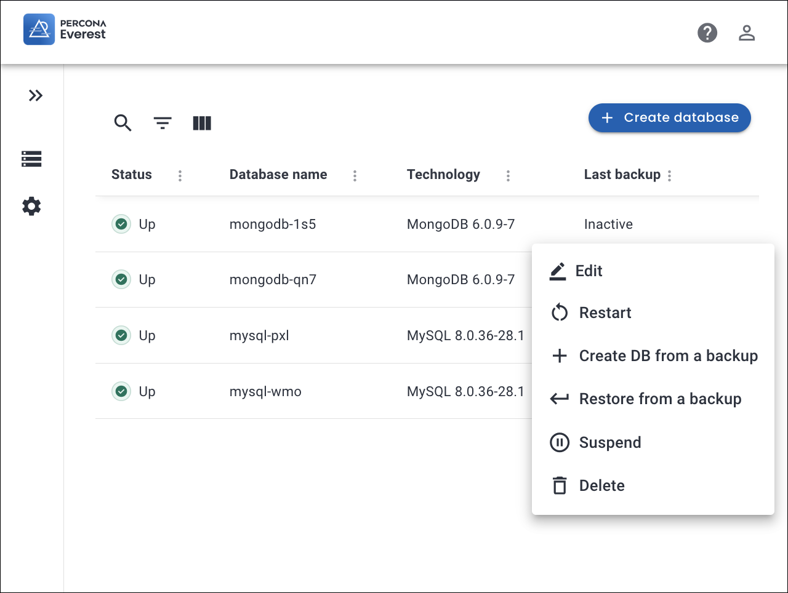
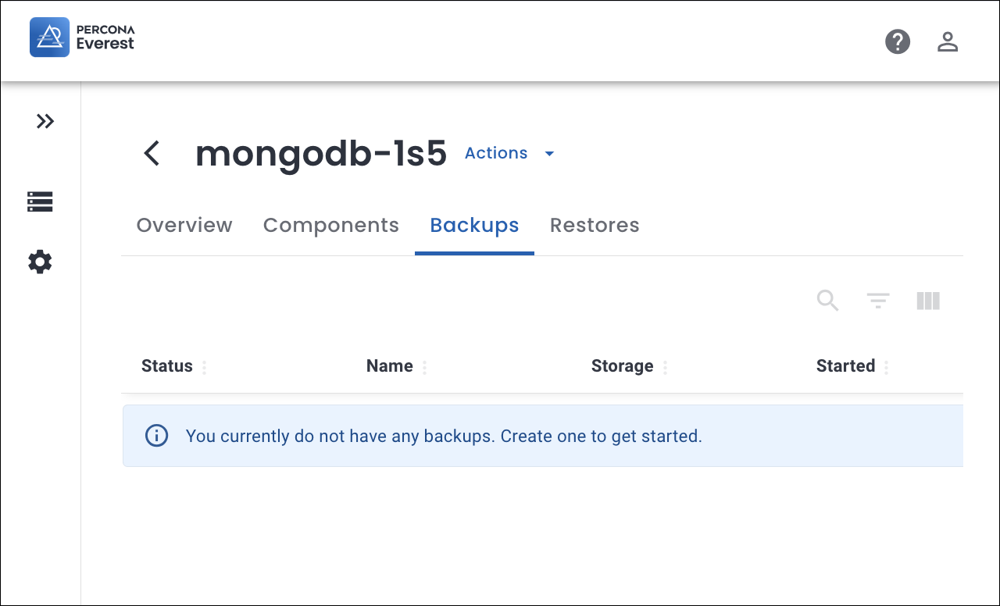
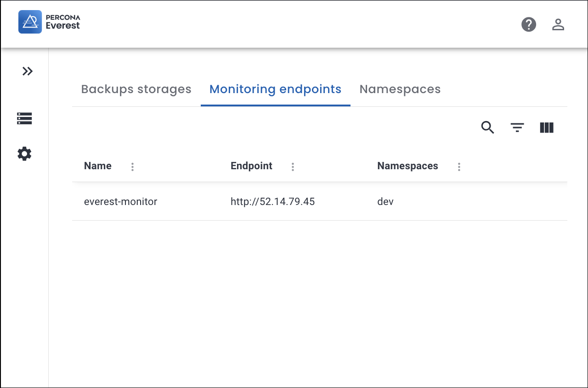

# Role Based Access Control

Role-based access control (RBAC) restricts access to resources within Percona Everest. It establishes a framework that defines access permissions and privileges according to individual users' roles. With RBAC, only authorized individuals can access specific information or perform certain actions based on their assigned roles. This method improves security by minimizing the risk of unauthorized access and helps manage permissions more efficiently across Percona Everest.


## Default role

In Percona Everest, the only predefined default role is **adminrole:role**, which is assigned to the **admin** user. Hence, this **admin** user has unrestricted access to Percona Everest. However, the RBAC (Role-Based Access Control) configuration can define and allocate specific roles based on individual requirements and access privileges.

This default built-in role definition can be seen in [policy.csv](https://github.com/percona/everest/blob/main/deploy/quickstart-k8s.yaml#L91).

## RBAC resources and privileges

Below is a comprehensive table outlining the permissions granted for various **resources**:

??? info "Permissions for resources"


    !!! warning "Important"
        If you have permission for specific namespaces or resources, you can perform read, update, create, or delete actions only on those resources or only within those namespaces. However, if you have permission for **all** the resources or namespaces, you can carry out these actions across all the resources and namespaces.

    </br> </br>

    **Table: Privileges for the various resources in Percona Everest**

    |**Resource**| **Read**| **Create**| **Update**|**Delete**|
    |------------|---------|-----------|-----------|----------|
    | namespaces|You can view namespaces| :x:  |:x: | :x:|
    | database-engines </br> (MySQL, MongoDB, PostreSQL)|You view can database engines when you create databases</br>  </br>**Note**: This policy must at least be **read all** so the users can create databases.| :x: |Modify database engines| :x:|
    | database-clusters|You can view databases| You can create databases|You can modify databases| You can delete databases|
    | database-cluster-backups|You can view database cluster backups| You can create database cluster backups|You can modify database cluster backups| You can delete database cluster backups|
    | database-cluster-restores|You can view database cluster restores| You can create database cluster restores|You can modify database cluster restores| You can delete database cluster restores|
    | backup-storages and monitoring-instances |You can view backups and monitroing endpoints| You can create backups and monitroing endpoints|You can modify backups and monitroing endpoints| You can delete backups and monitroing endpoints|
    | database-cluster-credentials|View database data (credentials) </br> </br>**Note**: If no policy is defined:</br> * You cannot see the credentials and the connection string.</br> * You also cannot create a database from any backup.| :x: |:x:| :x:|


## Policy definition in RBAC

RBAC policies are the rules and guidelines that define how roles, permissions, and users are managed within RBAC. These policies ensure that users have appropriate access to resources based on their roles within Percona Everest.


The policy definiton in Percona Everest is:


```sh
p, <subject>, <resource-type>, <action>, <resource-name>
```

Where:

**subject**: Refers to the name of the role or user. For example, `adminrole:role` or `admin`

**resource-type**: Refers to the type of Everest resource, such as `namespaces`, `database-clusters`, `database-engines`, etc.

**action**: Refers to the action the subject can perform. For example, `read`, `update`, `delete`, `create`, or `*`

**resource-name**: Refers to a specific instance of the given resource-type. The argument should be prefixed with the namespace in which the resource is present. For example `my-namespace/my-cluster-1`, `my-namespace-2/my-backup-1`, etc. You may also use a wildcard, such as `*`, `*/*` or `my-namespace/*`

### Admin policy

Check out the policy for an **Admin** role:

```sh
    p, adminrole:role, namespaces, read, *
    p, adminrole:role, database-engines, *, */*
    p, adminrole:role, database-clusters, *, */*
    p, adminrole:role, database-cluster-backups, *, */*
    p, adminrole:role, database-cluster-restores, *, */*
    p, adminrole:role, database-cluster-credentials, read, */*
    p, adminrole:role, backup-storages, *, */*
    p, adminrole:role, monitoring-instances, *, */*
```

### Read only policy

Check out the policy for a **readonly** role:

```sh
    p, readonly:role, namespaces, read, *
    p, readonly:role, database-engines, read, */*
    p, readonly:role, database-clusters, read, */*
    p, adminrole:role, database-cluster-backups, *, */*
    p, adminrole:role, database-cluster-restores, *, */*
    p, adminrole:role, database-cluster-credentials, read, */*
    p, readonly:role, backup-storages, read, */*
    p, readonly:role, monitoring-instances, read, */*
```


    


??? Example "Examples"

    Let's dive into some role definitions for RBAC:
    {.power-number}


    1. **Admin group role for a single namespace**

        Let's set up an Admin group role definition for just one namespace called `the-dark-side`.

        ```sh
        p, admin-darkside:role, namespaces, read, the-dark-side
        p, admin-darkside:role, database-engines, *, the-dark-side/*
        p, admin-darkside:role, database-clusters, *, the-dark-side/*
        p, admin-darkside:role, database-cluster-credentials, read, the-dark-side/*
        p, admin-darkside:role, backup-storages, *, the-dark-side/*
        p, admin-darkside:role, monitoring-instances, *, the-dark-side/*
        ```

        ??? info "Let's dive into decoding this!"

            The `admin-darkside` role has the following privileges **only** within `the-dark-side` namespace:

            - **namespace**:  `Read` access to the `the-dark-side`  .
            - **Database engines**: `Read` and `update` access
            - **Database clusters**: `All` access (read, create, update, delete)
            - **Database clusters credentials**: `Read` acccess
            - **Backup storages**: `All` access (read, create, update, delete)
            - **Monitoring instances**: `All` access (read, create, update, delete)


    2. **Dev group role with read/update/create access to single namepsace**

        Let's set up a dev group role definition with **read/update/create** access within the namespace called as `dev`:

        ```sh       
        p, team-dev:role, namespaces, read, dev
        p, team-dev:role, database-engines, read, dev/*
        p, team-dev:role, database-clusters, read, dev/*
        p, team-dev:role, database-clusters, update, dev/*
        p, team-dev:role, database-clusters, create, dev/*
        p, team-dev:role, database-clusters, delete, dev/*
        p, team-dev:role, database-cluster-credentials, read, dev/*
        p, team-dev:role, backup-storages, read, dev/*
        p, team-dev:role, monitoring-instances, read, dev/*
        p, team-dev:role, database-cluster-restores, create, dev/*
        g, john, team-dev:role
        ```

        ??? info "Let's dive into decoding this!"

            The `team-dev` role has the following privileges **only** within `dev` namespace:

            - **namespace**:  `Read` access to `dev`
            - **Database engines**: `Read` access
            - **Database clusters**: `Read` access
            - **Database clusters**: `Update` acccess
            - **Database clusters**: `Create` acccess

            

            - **Database cluster credentials**: `Read` acccess
            - **Backup storages**: `Read` access

            

            - **Monitoring instances**: `Read` access

            

            - **Database cluster restores**: `Create` access


    3. **Dev group role with full access to a single database**

        Let's set up a dev group role with **full** access for just one database called `banana` within `the-dark-side`:

        ```sh
        p, team-darkside-banana:role, namespaces, read, the-dark-side
        p, team-darkside-banana:role, database-engines, read, the-dark-side/*
        p, team-darkside-banana:role, database-clusters, read, the-dark-side/banana
        p, team-darkside-banana:role, database-clusters, update, the-dark-side/banana
        p, team-darkside-banana:role, database-clusters-credentials, read, the-dark-side/banana
        p, team-darkside-banana:role, backup-storages, read, the-dark-side/*
        p, team-darkside-banana:role, monitoring-instances, read, the-dark-side/*
        ```

        ??? info "Let's dive into decoding this!"

            The `team-darkside-banana` role has the following privileges for **single** database `banana' within `the-dark-side` namespace:

            - **namespace**:  `Read` access to the `the-dark-side`  .
            - **Database engines**: `Read` access to all the database engines
            - **Database clusters**:  Read and update access for **only** the `banana` database
            - **Database clusters credentials**: `Read` acccess for **only** the `banana` database
            - **Backup storages**: Read access to all the backup storages
            - **Monitoring instances**: Read access to all the monitoring instances


    4. **Dev group role definition with read/update/create access to all the namespaces**

        Let's set up a dev group role with **read/update/create** access to **all** the namespaces:

        ```sh
        p, team-darkside:role, namespaces, read, */*
        p, team-darkside:role, database-engines, read, */*
        p, team-darkside:role, database-clusters, read, */*
        p, team-darkside:role, database-clusters, update, */*
        p, team-darkside:role, database-clusters-credentials, read, */*
        p, team-darkside:role, backup-storages, read, */*
        p, team-darkside:role, monitoring-instances, read, */*
        ```

        ??? info "Let's dive into decoding this!"

            The `team-darkside` role has the following privileges in **all** the namespaces:

            - **namespace**:  `Read` access in all the namespaces.
            - **Database engines**: `Read` access to all the database engines
            - **Database clusters**:  `Read` and update access for all the database clusters
            - **Database clusters credentials**: `Read` acccess for **all** the databases
            - **Backup storages**: `Read` access to all the backup storages
            - **Monitoring instances**: `Read` access to all the monitoring instances


## Assigning roles to users

In order for roles to take effect, they need to be assigned to users. The syntax for this is as follows:

```sh
g, username, rolename
```

A new user in Percona Everest will initially have **no** permissions. To grant permissions, you must edit your RBAC configuration stored in the `everest-rbac` `ConfigMap` in the `everest-system` namespace:


```sh
kubectl edit configmap-rbac -n everest-system
```

A text editor will open, and you can edit the `ConfigMap` as follows. You just have to add the new user and assign it the desired role.


```sh
apiVersion: v1
kind: ConfigMap
metadata:
  name: everest-rbac
data:
  policy.csv: |
    p, adminrole:role, namespaces, read, *
    p, adminrole:role, database-engines, *, */*
    p, adminrole:role, database-clusters, *, */*
    p, adminrole:role, database-cluster-backups, *, */*
    p, adminrole:role, database-cluster-restores, *, */*
    p, adminrole:role, database-cluster-credentials, read, */*
    p, adminrole:role, backup-storages, *, */*
    p, adminrole:role, monitoring-instances, *, */*
    g, admin, adminrole:role
    g, <newuser>, adminrole:role
```

For example, let's assign the role `team-darkside:role` to a new user named John:

```sh
 p, team-darkside:role, namespaces, read, */*
 p, team-darkside:role, database-engines, read, */*
 p, team-darkside:role, database-clusters, read, */*
 p, team-darkside:role, database-clusters, update, */*
 p, team-darkside:role, database-clusters-credentials, read, */*
 p, team-darkside:role, backup-storages, read, */*
 p, team-darkside:role, monitoring-instances, read, */*
 g, john, team-darkside:role
```


## Validate your RBAC policy

You can verify whether your Role-based access control (RBAC) policies are functioning correctly by executing the following command:

```sh
everestctl settings rbac validate --policy-file
```

Where:

`policy-file `is an optional flag that takes the **policy file** path. If you do not specify the path to this file, it will look for the configuration file inside your existing Percona Everest installation, that is, under RBAC `ConfigMap`.

??? Example "Policy validation"

    The following example demonstrates that this is a valid policy.

    ```sh
    everestctl settings rbac validate --policy-file ./pkg/rbac/testdata/policy-1-good.csv
    ```
    Output:

    ```{.text .no-copy}
    ✓ Valid
    ```

    The following example demonstrates that this is an invalid policy.


    ```sh
    everestctl settings rbac validate --policy-file ./pkg/rbac/testdata/policy-bad.csv
    ```

    output:

    ```{.text .no-copy}
    × Invalid
    policy syntax error - unknown resource name 'non-existent-resource'
    ```


## Test your RBAC policy

You can verify if a role or individual (such as a group or a local user) has the necessary privileges to perform particular operations on designated resources. 

We have a straightforward command that can be used to test the RBAC (Role-Based Access Control) policies:


```sh
everestctl settings rbac can --policy-file
```

Where:

`policy-file `is an optional flag that takes the **policy file** path. If you do not specify the path to this file, it will look for the configuration file inside your existing Percona Everest installation, that is, under RBAC `ConfigMap`.


??? Example "Test your policy"

    The following example tests whether a user, **Alice**, can create database clusters:

    ```sh
    everestctl settings rbac can alice create database-clusters '*' --policy-file ./pkg/rbac/testdata/policy-1-bad.csv
    ```
    Output

    ```{.text .no-copy}
    No
    ```


    The following example tests whether an **Admin** user can create database clusters:
    
    ```sh
    everestctl settings rbac can admin create database-clusters '*' --policy-file ./pkg/rbac/testdata/policy-1-good.csv
    ```

    Output:

    ```{.text .no-copy}
    Yes
    ```


    
    
  


