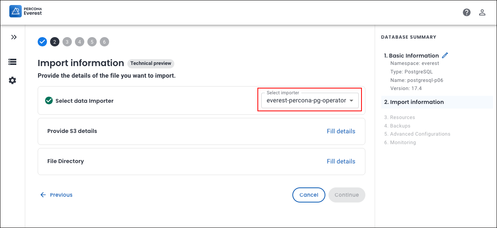

# DataImporter: Percona PostgreSQL operator

The `everest-percona-pg-operator` data importer enables you to import PostgreSQL backups stored in external S3-compatible storage into clusters managed by Percona Everest.
{.power-number}

1. Log in to the Percona Everest UI.

2. From the Percona Everest homepage, click **Import**. Select the database type you want to import(MySQL, PostgreSQL, or MongoDB). The **Basic Information** page will be displayed.


3. Fill in the details on the **Basic information** page and click **Continue**. This will take you to the **Import information** page.

3. Select the `DataImporter` from the dropdown on the **Import information** page. 

    

    - Click **Fill details** to provide your S3 storage details. The **S3 details** page will open. Enter the following: 
    
       - **Bucket name**:  Enter the unique name identifying your S3 storage bucket.
       - **Region**: Select the geographical AWS region where your bucket is hosted (e.g., us-east-1, eu-west-1)
       - **Access key**: Enter your AWS Access Key ID (like a username for API access).
       - **Secret key**: Enter your AWS Secret Access Key (like a password for secure API access).
        
      Click **Save**.

     


    - In the **File directory** section, specify the path within your S3 bucket where the backup files are stored. Click **Save**.

    !!! info "Important"
        Percona Everest does not validate file paths or verify the existence of files in the specified storage buckets. Make sure that the backup directory path is correct and accessible.

        To verify that the specified path exists, you can use the AWS CLI:
            
            ```
            aws s3 ls s3://<bucket-name>/<path-to-backup> --region <region>
            ```


    ??? example "Find the file path using AWS CLI"
        !!! info "Find the file path using AWS CLI"
            **Prerequisites:** Ensure AWS CLI is installed and configured on your system. To install AWS CLI, refer to the [AWS CLI installation guide](https://docs.aws.amazon.com/cli/latest/userguide/getting-started-install.html){:target="_blank"}.
                       

            1. Run the following command:

                ```sh
                cat > ~/.aws/credentials
                [default]
                aws_access_key_id = SECRET
                aws_secret_access_key = SECRET
                ```
            
            2. Navigate your S3 bucket structure:
            
                ```sh
                # List the folders in the bucket
                aws s3 ls <S3 bucket-name>

                # Output
                PRE postgresql-nf9/

                # List the subfolders:
                aws s3 ls <S3 bucket-name>/postgresql-nf9/
                
                # Output
                PRE bd68c303-33eb-4368-b564-2cc4b9c71163/

                # Drill down further:
                aws s3 ls <S3 bucket-name>/postgresql-nf9/bd68c303-33eb-4368-b564-2cc4b9c71163/

                # Output
                PRE archive/
                PRE backup/


                # Go into the backup folder
                aws s3 ls <S3 bucket-name>/postgresql-nf9/bd68c303-33eb-4368-b564-2cc4b9c71163/backup/

                # Output
                PRE db/


                # Go into the db folder
                aws s3 ls <S3 bucket-name>/postgresql-nf9/bd68c303-33eb-4368-b564-2cc4b9c71163/backup/db/

                # Output
                PRE 20250702-085755F/
                PRE backup.history/
                2025-07-02 14:28:53   1174 backup.info
                2025-07-02 14:28:53   1174 backup.info.copy

            
                The full file path for PostgreSQL will be:
                /postgresql-nf9/bd68c303-33eb-4368-b564-2cc4b9c71163/backup/db/20250702-085755F/
                ```

    


3. Click **Continue**. You will see the basic information page for your target database.

4. Enter the information and click **Continue** until you reach the end of the wizard.

    Your backup import process will now start. Once the import is successful, the database status will eventually change to **Up**.

    


        


