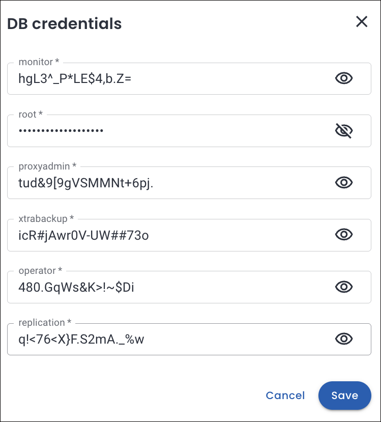
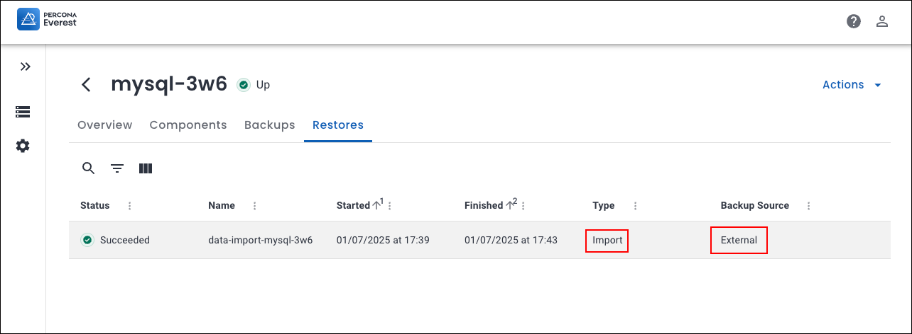

# DataImporter: Percona Operator for MySQL (XtraDB)

The `everest-percona-pxc-operator` dataimporter allows you to import backups taken using the Percona Operator for MySQL (XtraDB).

##  Prerequisites

- Backup taken using the Percona MongoDB Operator stored in an S3-compatible storage bucket
- Credentials to access the S3 bucket (AccessKeyID and SecretAccessKey)
- System user credentials from the source cluster.


## How to import external MySQL backups using the Percona Everest UI

This section outlines the step-by-step process for importing backups using the Percona Everest UI.
{.power-number}

1. Log in to the Percona Everest UI.

2. From the Percona Everest homepage, click **Import**. Select the database as **MySQL**. The **Basic Information** page will then be displayed.


3. Fill in the details on the **Basic information** page and click **Continue**. This will take you to the **Import information** page.

4. Select the data importer from the dropdown on the **Import information** page.

    

    - Click **Fill details** to provide your S3 storage details. The **S3 details** page will open. Enter the following:

        - **Bucket name**:  Enter the unique name identifying your S3 storage bucket.
        - **Region**: Select the geographical AWS region where your bucket is hosted (e.g., us-east-1, eu-west-1)
        - **Access key**: Enter your AWS Access Key ID (like a username for API access).
        - **Secret key**: Enter your AWS Secret Access Key (like a password for secure API access).
        
        Click **Save**.

        

    - In the **File directory** section, specify the path within your S3 bucket where the backup files are stored. Click **Save**.

        !!! info "Important"
            Percona Everest does not validate file paths or verify the existence of files in the specified storage buckets. Make sure that the backup directory path is correct and accessible.

            To verify that the specified path exists, you can use the AWS CLI:

            ```
            aws s3 ls s3://<bucket-name>/<path-to-backup> --region <region>
            ```


        ??? example "Example"

            !!! info "Find the file path using AWS CLI"
                **Prerequisites:** Ensure AWS CLI is installed and configured on your system. To install AWS CLI, follow the [AWS CLI installation guide](https://docs.aws.amazon.com/cli/latest/userguide/getting-started-install.html){:target="_blank"}.


            1. Run the following command:

                ```sh
                cat > ~/.aws/credentials
                [default]
                aws_access_key_id = SECRET
                aws_secret_access_key = SECRET
                ```
            
            2. Navigate your S3 bucket structure:
            
                ```sh
                # List the folders in the bucket
                aws s3 ls <S3 bucket-name>


                # Output
                PRE mongodb-zh5/
                PRE mysql-wih/
                

                # List the subfolders
                aws s3 ls <S3 bucket-name>/mysql-wih/
                
                # Output
                PRE 515f9e1b-301d-4b34-b2bd-959713bc70d0/


                # Drill down further
                aws s3 ls <S3 bucket-name>/mysql-wih/515f9e1b-301d-4b34-b2bd-959713bc70d0/
            

                # Output
                PRE mysql-wih-2025-07-01-11:40:18-full.sst_info/
                PRE mysql-wih-2025-07-01-11:40:18-full/
                2025-07-01 17:10:49  
                25765 mysql-wih-2025-07-01-11:40:18-full.md5
                2025-07-01 17:10:36  
                128 mysql-wih-2025-07-01-11:40:18-full.sst_info.md5

                The full file path for MySQL will be:
                /mysql-wih/515f9e1b-301d-4b34-b2bd-959713bc70d0/mysql-wih-2025-07-01-11:40:18-full/
                ```

        


    - In the **DB Credentials** section, enter the key-value pairs of the user secrets.

        

        ??? example "Retrieve the DB credentials from the Kubernetes secrets"
            Run the following command to decode the credentials stored in the Kubernetes secret:


            ```sh
            kubectl get secret everest-secrets-mysql-wih -n everest -o jsonpath="{.data}" | jq 'map_values(@base64d)'
            ```

            Output

            ```sh
            {
                "monitor": "hgL3^_P*LE$4,b.Z=",
                "operator": "480.GqWs&K>!~$Di",
                "proxyadmin": "tud&9[9gVSMMNt+6pj.",
                "replication": "q!<76<X}F.S2mA._%w",
                "root": "_bvt*Ip*@r-JOpz>q@1",
                "xtrabackup": "icR#jAwr0V-UW##73o"
            }
            ```


5. Click **Continue**. You will see the basic information page for your target database.

6. Enter the information and click **Continue** until you reach the end of the wizard.

    Your backup import process will now start. Once the import is successful, the database status will change to **Up**.

    


        


