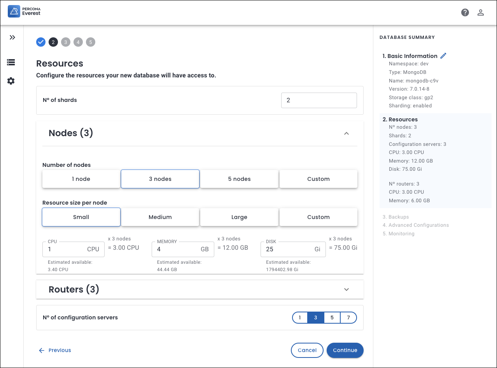

# MongoDB sharding

[Sharding  :octicons-link-external-16:](https://docs.mongodb.com/manual/reference/glossary/#term-sharding) is used for horizontal database scaling. It distributes a database horizontally across multiple nodes or servers, known as **shards**. Each shard manages a portion of the data, forming a sharded cluster, which enables MongoDB to handle large datasets and high user concurrency effectively.

## Key components of MongoDB sharding

- **Shard:** Each shard has a subset of the data.
- **Routers: **The query router directs the client queries to the proper shard(s).

    !!! info "Important"
        With the current Percona Everest release, the number of routers (mongos) is, by default, set to the number of nodes in your replica set. However, in our upcoming releases, you can customize the number of routers and set resource limits for them.

- **Config servers:** The configuration servers store the cluster's metadata and configuration settings.

## Why sharding?

Here are the key reasons for implementing sharding:

### Scalability

By increasing the number of shards in the cluster, you can scale your system horizontally. This enables you to manage larger datasets and handle higher traffic volumes, ensuring your system remains responsive and efficient despite growing demands.

### Improved performance

By splitting data across multiple servers, sharding reduces the load on any one server, that leads to faster query response times. Since each shard contains only a fraction of the total data, queries targeting a specific shard can be processed faster.

### Availability

If one shard (or server) fails, the remaining shards can continue to operate, enhancing the system's availability and fault tolerance. Data replication across shards ensures that no information is lost in the event of a failure.

## Enable sharding in Percona Everest

To enable sharding:
{.power-number}

1. On the **Create Database** wizard, select **MongoDB** database and turn on the **Sharded Cluster** toggle. Click **Continue**. The **Resources** page will be displayed.

    

2. On the **Resources** page, choose or enter the following details:

      a. Number of Shards

      b. On the **Nodes** panel, select the **Number of nodes** and the corresponding **Resurce size per node**.

      c. On the **Routers** panel, select the **Number of routers** and the corresponding **Resource size per router**.

      d. Number of configuration servers

       

3. To check if sharding is enabled, go to the database view page and click on the specific database. Then, check the **Resources** panel to see if sharding is enabled.

    

