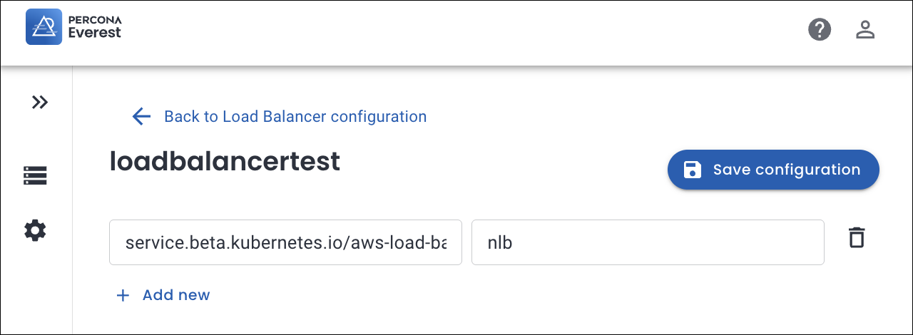
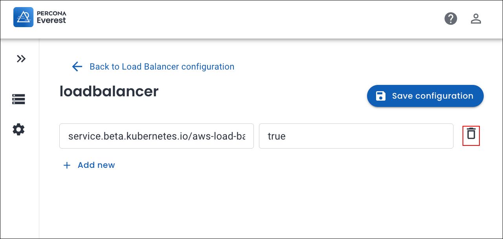

# Creating and managing load balancer configurations


## Create a load balancer configuration

Here's how you can create a load balancer configuration:
{.power-number}

1.  Navigate to the Percona Everest home page and go to <i class="uil uil-cog"></i> **Settings > Policies**.

    

2. In the **Load Balancer configuration** section, click **Configure**. The **Load balancer configuration** page opens.

    

3. Click **Create configuration**. A pop-up window appears.

    

4. Enter a **Configuration name** and click **Create**.

5. Enter the annotations (key-value pairs) for your load balancer configuration. 

    

    !!! note
        The **key** and **value** in a Load Balancer configuration for Percona Everest are derived from your Kubernetes environment and the load balancer implementation by your cloud provider.

    ??? example "Examples of keys and values used for Load balancer configuration"

        ```sh
        service.beta.kubernetes.io/aws-load-balancer-type: "nlb"                    # Use Network Load Balancer (NLB)
        service.beta.kubernetes.io/aws-load-balancer-scheme: "internet-facing"        # Internet-facing vs. internal
        service.beta.kubernetes.io/aws-load-balancer-internal: "true"                   # Internal LB
        service.beta.kubernetes.io/aws-load-balancer-ssl-cert: "arn:aws:acm:..."        # Attach ACM SSL cert
        service.beta.kubernetes.io/aws-load-balancer-ssl-ports: "443"                   # SSL termination ports
        service.beta.kubernetes.io/aws-load-balancer-backend-protocol: "http"        # Protocol between LB and pods
        ```

6. Click **Save configuration**.

7. Click **Back to Load Balancer Configuration** to view the newly created load balancer configuration.

    

## Manage load balancer configuration

Here's how you can edit and delete the load balancer configuration:
{.power-number}

1.  Navigate to the Percona Everest home page and go to <i class="uil uil-cog"></i> **Settings > Policies**.

2. In the **Load Balancer configuration** section, click **Configure**. The list of existing configurations appears.

3. To add new annotations for an existing load balancer configuration, click on the specific load balancer configuration and click **Add new**.

4. Enter the annotations and click **Save configuration**.

5. To delete annotations for the load balancer configuration, click the delete button next to it.

    

6. To modify the annotations, click **Edit configuration**.

    


## Configuring load balancer for external database access

You can expose a database cluster outside of the Kubernetes network during database creation:
{.power-number}

1. Log into the Percona Everest UI.

2. On the Percona Everest homepage, click **Create database**. Select the database that you wish to provision.

3. Continue through the setup until you reach the **Advanced Configurations** page.

4. In the **Enable External Access** section, turn the toggle **ON**. 

5. Select **Load balancer** as the **Exposure method** from the dropdown.

    

6. Select the desired **Load balancer configuration** from the dropdown.

7. (Optional) In the **Source range** field, enter trusted IP addresses to restrict access.

    - To add multiple Source ranges, click **Add new**. Enter the specific IP addresses seperately.


    !!! note
        Leaving the **Source range** blank will expose the database to all the IP addresses (0.0.0.0/0). This is not recommended for production environments.


 


