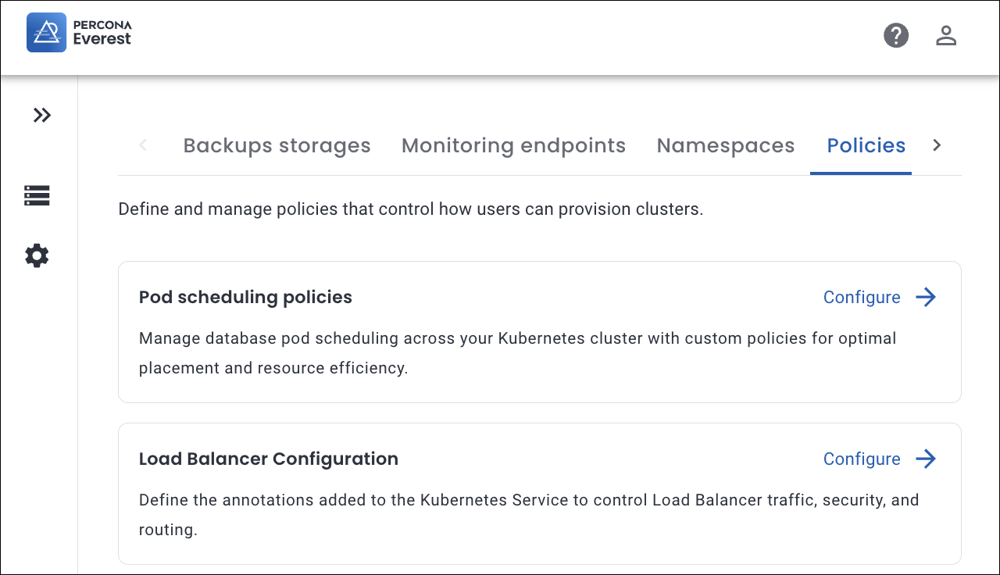

# Creating and managing load balancer configurations

## How to create and manage load balancer config

Here's how you can create load balancer config:
{.power-number}

1.  Navigate to Percona Everest home page and select <i class="uil uil-cog"></i> **Settings > Policies**.

    

2. In the **Load Balancer configuration** section, click **Configure**. The **Load balancer configuration** page opens.

    

3. Click **Create configuration**. A pop-up window appears.

    

4. Enter the desired **Configuration name** and click **Create**.

5. Enter the key and value for your load balancer configuration. 

    

    !!! note
        The **key** and **value** in a Load Balancer configuration for Percona Everest are derived from your Kubernetes environment and the load balancer service implementation of your cloud provider.

    ??? example "Examples of keys and values used for Load balancer configuration"

        service.beta.kubernetes.io/aws-load-balancer-type: "nlb"                    # Use Network Load Balancer (NLB)
        service.beta.kubernetes.io/aws-load-balancer-scheme: "internet-facing"        # Internet-facing vs. internal
        service.beta.kubernetes.io/aws-load-balancer-internal: "true"                   # Internal LB
        service.beta.kubernetes.io/aws-load-balancer-ssl-cert: "arn:aws:acm:..."        # Attach ACM SSL cert
        service.beta.kubernetes.io/aws-load-balancer-ssl-ports: "443"                   # SSL termination ports
        service.beta.kubernetes.io/aws-load-balancer-backend-protocol: "http"        # Protocol between LB and pods

5. To add new Key–value pairs for the load balancer configuration, click **Add new**.

6. To delete any Key–value pair for the load balancer configuration, click on delete.

6. Click **Save configuration**.

7. To check the newly created load balancer configuration, click **Back to Load Balancer configuration**.

    

### Manage load balancer config

Here's how you can edit and delete the load balancer config:

## Configuring load balancer for external database access

You can expose a database cluster available outside of Kubernetes network while creating it:
{.power-number}

1. Log into the Percona Everest UI.

2. On the Percona Everest homepage, click **Create database**. The menu for the different database types will open. Select the database that you wish to provision.

3. Continue through the setup pages until you reach the **Advanced Configurations** page.

4. In the **Enable External Access** section, turn the toggle **ON**. 

5. Select **Load balancer** as the **Exposure method** from the dropdown.

6. Select the desired **Load balancer configuration** from the dropdown.

7. (Optional) In the **Source range** field, enter trusted IP addresses to restrict access.

    !!! note
        Leaving the **Source range** blank will expose the database to all the IP addresses, which is not recommended.

8. To add multiple Source ranges, click Add new. Enter the specific IP addresses seperately.

 

