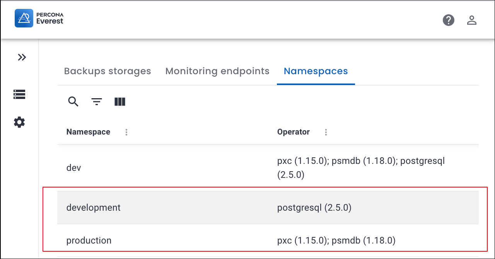

# What's new in Percona Everest 0.8.0

To begin your journey with Percona Everest, check out the [Quickstart Guide for Percona Everest](../quickstart-guide/quick-install.md).

Percona Everest is an open source private database-as-a-service that helps developers deploy code faster, scale deployments rapidly, and reduce database administration overhead. Plus, you can regain control over your data, database configuration, and DBaaS costs.

Version 0.8.0 introduces the following changes:

## Beta release

We're excited to announce that Percona Everest is now in Beta!

Under development for the past six months and in testing since October 2023, we're now taking Percona Everest public, making it open for anyone who wants to explore our Cloud Native database platform.

Be an early adopter and join us in driving its progress!

## Release highlights

### Multiple namespaces

Starting with Percona Everest 0.8.0, we have introduced a new feature called **Multiple namespaces**. With this feature, you can create separate groups of resources within a single cluster. Namespaces enable you to partition your clusters logically, organizing and managing the resources effectively without impacting other resources in the same cluster.

To view the list of configured namespaces, navigate to <i class="uil uil-cog"></i> **Settings > Namespaces** on the Percona Everest UI.

    

To gain a deeper understanding of this feature, refer to our comprehensive [documentation](https://docs.percona.com/everest/use/multi-namespaces.html).

### Support for scheduled backups for PostgreSQL

We’re expanding Percona Everest’s schedule backup functionality to include PostgreSQL databases. This enables you to run automatic backups at predefined times for PostreSQL as well.

However, due to a limitation on PostgreSQL Operator, scheduling is currently restricted to a maximum of three concurrent backups for PostgreSQL databases.

## New features and improvements

- [EVEREST-509](https://perconadev.atlassian.net/browse/EVEREST-509) - We have now enabled Scheduled backups for the PostgreSQL operator.

- [EVEREST-748](https://perconadev.atlassian.net/browse/EVEREST-748) Integrate with PGO v2.3.1

- [EVEREST-821](https://perconadev.atlassian.net/browse/EVEREST-821) \[UI\] Add copy button to connection's host string

- [EVEREST-827](https://perconadev.atlassian.net/browse/EVEREST-827) - A constraint prevented the execution of more than three Backup schedules for the Postgresql database. We have addressed this, and you can now execute backup schedules for the Postgresql database without any constraints.

## Bugs fixed

- [EVEREST-758](https://perconadev.atlassian.net/browse/EVEREST-758) - Unable to turn on monitoring

- [EVEREST-802](https://perconadev.atlassian.net/browse/EVEREST-802) - The storage location was enabled while editing a MongoDB database. This was not the expected behavior. The storage location should not be changed once set up during database creation. The issue has been resolved now.

- [EVEREST-814](https://perconadev.atlassian.net/browse/EVEREST-814) - After uninstalling and reinstalling Percona Everest, the login token was not displayed. To log in to Percona Everest, the token from the first installation had to be used. The issue has been resolved now.

- [EVEREST-819](https://perconadev.atlassian.net/browse/EVEREST-819) Backup schedules more than three do not run for postgresql database

- [EVEREST-822](https://perconadev.atlassian.net/browse/EVEREST-822) Postgresql database created from a backup cannot be restored

- [EVEREST-825](https://perconadev.atlassian.net/browse/EVEREST-825) PG cluster stuck initialising after restoration

- [EVEREST-826](https://perconadev.atlassian.net/browse/EVEREST-826) \[Operator\] PG on-demand backups are incremental instead of full

- [EVEREST-833](https://perconadev.atlassian.net/browse/EVEREST-833) \[UI\] Database version is blank when a new database is created from backup

- [EVEREST-854](https://perconadev.atlassian.net/browse/EVEREST-854) - Fixed an issue where the default number of nodes on the **Resources** page for MySQL showed up as 1 instead of 3. 

