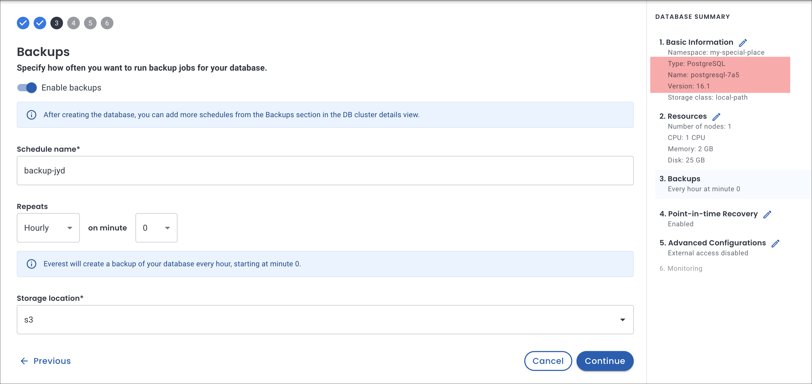

# What's new in Percona Everest 0.8.0

!!! caution alert alert-warning "Important"
    Persona Everest introduces a breaking change that prevents you from directly upgrading to Perfcona Everest version 0.8.0.

    To install Percona Everest version 0.8.0, you need to uninstall any previous versions of Percona Everest that you have installed on your system. After uninstalling the previous version, you can install Percona Everest 0.8.0.


To begin your journey with Percona Everest, check out the [Quickstart Guide for Percona Everest](../quickstart-guide/quick-install.md).

Percona Everest is an open source cloud native database platform that helps developers deploy code faster, scale deployments rapidly, and reduce database administration overhead. Plus, you can regain control over your data, database configuration, and DBaaS costs.

Version 0.8.0 introduces the following changes:

## Beta release

We're excited to announce that Percona Everest is now in Beta!

Under development for the past six months and in testing since October 2023, we're now taking Percona Everest public, making it open for anyone who wants to explore our Cloud Native database platform.

Be an early adopter and join us in driving its progress!

## Release highlights

### Multiple namespaces

Starting with Percona Everest 0.8.0, we have introduced a new feature called **Multiple namespaces**. With this feature, you can create separate groups of resources within a single cluster. Namespaces enable you to partition your clusters logically, organizing and managing the resources effectively without impacting the other resources in the same cluster.

To view the list of configured namespaces, navigate to <i class="uil uil-cog"></i> **Settings > Namespaces** on the Percona Everest UI.


To gain a deeper understanding of this feature, refer to our comprehensive [documentation](https://docs.percona.com/everest/use/multi-namespaces.html).

### Support for scheduled backups for PostgreSQL

We’re expanding Percona Everest’s schedule backup functionality to include PostgreSQL databases. This enables you to run automatic backups at predefined times for PostgreSQL as well.




However, due to a limitation on the PostgreSQL Operator, you cannot add more than three backup schedules for the PostgreSQL databases.

## New features and improvements

- [EVEREST-509](https://perconadev.atlassian.net/browse/EVEREST-509) - We've completed support for Scheduled Backups functionality, extending automated backup capabilities to PostgreSQL databases as well.

- [EVEREST-821](https://perconadev.atlassian.net/browse/EVEREST-821) - We've added a copy button next to the **Host** string on the **Connection Details** panel to enable you to copy the host string easily.

- [EVEREST-748](https://perconadev.atlassian.net/browse/EVEREST-748) - The PostgreSQL operator has been upgraded to version 2.3.1.

## Bugs fixed

- [EVEREST-802](https://perconadev.atlassian.net/browse/EVEREST-802) - When editing a MongoDB database, the **Storage location** field on the **Backups** page is now disabled to prevent changes to the current location. This limitation stems from a restriction in Everest, which currently restricts MongoDB databases to utilizing a single storage location for backups.
- [EVEREST-814](https://perconadev.atlassian.net/browse/EVEREST-814) - While reinstalling Percona Everest, the login token was not displayed. To log in to Percona Everest, the token from the previous installation had to be used. We have resolved the issue, and now uninstalling Percona Everest removes the token also, which means that a new token will be generated upon subsequent installation.
- [EVEREST-827](https://perconadev.atlassian.net/browse/EVEREST-827) - When trying to set up a fourth scheduled backup for PostgreSQL databases, Everest now notifies that initiating another backup is not possible when three backup schedules are already in place. This restriction is due to a current limitation on the PostgreSQL Operator, which does not allow more than three backup schedules for the PostgreSQL databases.
- [EVEREST-822](https://perconadev.atlassian.net/browse/EVEREST-822) - Fixed an issue that sometimes occurred when restoring a Postgresql database from a backup.
- [EVEREST-826](https://perconadev.atlassian.net/browse/EVEREST-826)  - When initiating an on-demand backup for PostgreSQL databases, Everest would incorrectly perform incremental backups instead of conducting a full backup. This issue is now fixed.
- [EVEREST-833](https://perconadev.atlassian.net/browse/EVEREST-833) - When creating a new database from a backup, Everest now pre-fills the database version inherited from the backup artifact, ensuring consistency and compatibility throughout deployments.
- [EVEREST-854](https://perconadev.atlassian.net/browse/EVEREST-854) - Fixed an issue where the default number of nodes on the **Resources** page for MySQL showed up as 1 instead of 3. 

## Known issues

- [EVEREST-819](https://perconadev.atlassian.net/browse/EVEREST-819) - Due to a limitation on the PostgreSQL Operator, you cannot add more than three backup schedules for the PostgreSQL databases.
- [EVEREST-820](https://perconadev.atlassian.net/browse/EVEREST-820) - When performing a MongoDB database restore from a Point-in-Time (PITR), the displayed time in the UI does not align with the actual PITR creation time due to discrepancies between the PITR chunk creation time and the time at which chunks are uploaded to the S3 storage location.


## Limitations

!!! caution alert alert-warning "Important"
    To uninstall Percona Everest, use the uninstall command with the old CLI binary.

To install Percona Everest version 0.8.0, uninstall any previous versions of Percona Everest that you have installed on your system and then install Percona Everest 0.8.0.

To uninstall Percona Everest:
{.power-number}

1. Identify the namespace:

    ```sh
    export EVEREST_NS=percona-everest
    ```

2. Uninstall Everest:

    ```sh
    everestctl uninstall
    ```

3. Remove ALL created database clusters:

    ```sh
    kubectl delete db --all -n percona-everest
    ```

4. Remove ALL backups:

    ```sh
    kubectl -n $EVEREST_NS delete job --all
    kubectl -n $EVEREST_NS delete pxc-backup --all
    kubectl -n $EVEREST_NS delete psmdb-backup --all
    kubectl -n $EVEREST_NS delete pg-backup --all
    kubectl -n $EVEREST_NS delete pod --all
    ```

5. Remove ALL PVCs:

    ```sh
    kubectl delete pvc --all -n $EVEREST_NS
    ```

6. List CSVs and remove those with a "*percona*" and "*everest*" prefix, or remove ALL operators:

    ```sh
    kubectl delete sub --all -n $EVEREST_NS
    kubectl delete ip --all -n $EVEREST_NS
    kubectl delete csv --all -n $EVEREST_NS
    ```
7. Remove Everest OLM catalog:

    ```sh
    kubectl delete -f https://raw.githubusercontent.com/percona/percona-everest-cli/v0.7.0/data/crds/olm/percona-dbaas-catalog.yaml
    ```

8. Remove OLM installation (Do not delete it if it was installed without Everest support):

    ```sh
    kubectl delete -f https://raw.githubusercontent.com/percona/percona-everest-cli/v0.7.0/data/crds/olm/crds.yaml
    ```

    ```sh
    kubectl delete -f https://raw.githubusercontent.com/percona/percona-everest-cli/v0.7.0/data/crds/olm/olm.yaml
    ```

9. Remove percona-everest namespace:

    ```sh
    kubectl delete ns $EVEREST_NS
    ```