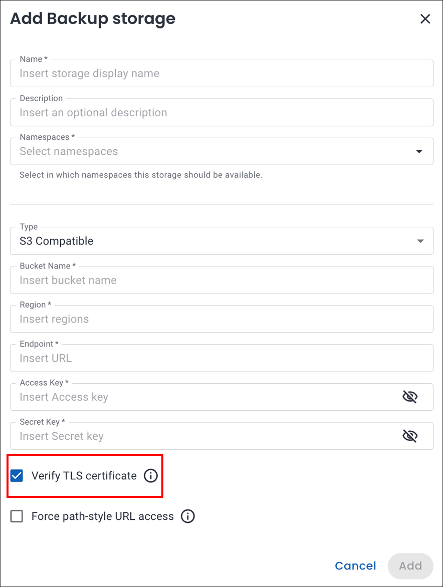

# What's new in Percona Everest 0.10.0

To begin your journey with Percona Everest, check out the [Quickstart Guide for Percona Everest](../quickstart-guide/quick-install.md).

Percona Everest is an open source cloud native database platform that helps provision and manage databases faster, scale deployments rapidly, and reduce database administration overhead. Plus, you can regain control over your data, database configuration, and DBaaS costs.

Version 0.10.0 introduces the following changes:

## Release highlights

### Simplified Percona Everest upgrades

!!! warning "Important"
    - You need to download CLI version >=0.10.0 for the upgrade command to work.
    - Upgrade works only if you have Percona Everest version 0.9.0 or higher installed. 

We're thrilled to announce that you can now upgrade your Percona Everest instance using our Command Line Interface (CLI). The CLI upgrade process is simple and straightforward, enabling you to quickly upgrade your Everest to the latest version.

You can only upgrade one minor version at a time. For instance, you can upgrade from version 0.9.0 to version 0.10.0.

For more information on upgrading Percona Everest, see our [documentation](https://docs.percona.com/everest/upgrade_with_cli.html).

### Streamlining traffic management with API rate limiting

Starting with Percona Everest 0.10.0 version, we have introduced a new feature called **API rate limiting**. 

API rate limiting is one of the key aspects of managing API's. With this you can set a threshold for the number of requests your API can receive within a specific period. This means you can take control and regulate the incoming traffic, mitigating the risk of server overload or abuse. 

The default rate limit for Percona Everest is 100 requests per second. However, you can customize these limits according to your usage patterns and requirements. To dive deep into this feature, see our comprehensive [documentation](https://docs.percona.com/everest/use/API_rate_limit.html).

### Added control for TLS certificate validation

With the release of Percona Everest 0.10.0, you can add backup storages and monitoring instances without verifying the Transport Layer Security (TLS) certificate. TLS certificate verifies the server's certificate chain and hostname, ensuring its authenticity.

When using a self-signed TLS certificate, the TLS certificate validation may fail as the certificate has not been issued by a trusted authority. To overcome this issue, you may need to skip the TLS certificate validation. 

Skipping certificate validation is recommended only when there is no need to ensure the authenticity of the server holding the certificate. For example, if you have a private network where you have complete control over everything, the identity check may not be required.

## New features and improvements

- [EVEREST-793](https://perconadev.atlassian.net/browse/EVEREST-793) - Starting with Percona Everest 0.10.0, you can upgrade your Percona Everest instance using the CLI (everestctl).

- [EVEREST-396](https://perconadev.atlassian.net/browse/EVEREST-396) - You can now add monitoring instances without verifying the TLS certificates. 

- [EVEREST-964](https://perconadev.atlassian.net/browse/EVEREST-964) - Starting with Percona Everest 0.10.0, we have introduced a new feature called **API rate limiting**. With this you can set a threshold for the number of requests your API can receive within a specific period.

- [EVEREST-935](https://perconadev.atlassian.net/browse/EVEREST-935) - Previously, the **cancel** button was disabled while editing anything in the wizard. This button is now enabled.

- [EVEREST-928](https://perconadev.atlassian.net/browse/EVEREST-928) - We have updated all the labels on the buttons to sentence case for consistency.

- [EVEREST-938](https://perconadev.atlassian.net/browse/EVEREST-938) - Restoring a database using PITR now includes a backup storage name.

### Backups

- [EVEREST-895](https://perconadev.atlassian.net/browse/EVEREST-895) - You can now add backup storage without verifying the TLS certificates.

- [EVEREST-919](https://perconadev.atlassian.net/browse/EVEREST-919) - You can now access backup storage with [path-style URLs](https://docs.aws.amazon.com/AmazonS3/latest/userguide/VirtualHosting.html#path-style-access).

- [EVEREST-668](https://perconadev.atlassian.net/browse/EVEREST-668) - We have introduced Retention copies while creating backup schedules. Retention copies refer to the number of backup instances that should be kept.

- [EVEREST-819](https://perconadev.atlassian.net/browse/EVEREST-819) - Due to the current limitation of PostgreSQL, you can only create up to 3 schedules. To avoid confusion, we have added a tooltip that states this limitation.

- [EVEREST-911](https://perconadev.atlassian.net/browse/EVEREST-911) - We added a new column to the database view displaying the time of the last backup.

- [EVEREST-912](https://perconadev.atlassian.net/browse/EVEREST-912) - We have added an icon and tooltip to the backups column.

## Bugs fixed

- [EVEREST-385](https://perconadev.atlassian.net/browse/EVEREST-385) - Previously, there was an issue where the backup and pods associated with a database cluster were not being deleted when the cluster itself was deleted. The issue has been resolved now.

- [EVEREST-846](https://perconadev.atlassian.net/browse/EVEREST-846) - Fixed an issue where the new database contained the backups of the old database with the same name.

- [EVEREST-921](https://perconadev.atlassian.net/browse/EVEREST-921) - We have resolved an issue that prevented users from logging in immediately after logging out.

- [EVEREST-947](https://perconadev.atlassian.net/browse/EVEREST-947) - While attempting to uninstall Percona Everest, an error occurred which prevented the uninstallation process from completing successfully. The issue has now been resolved.

- [EVEREST-948](https://perconadev.atlassian.net/browse/EVEREST-948) - The actionable **Alert** button was not visible in the dark theme. The issue has been resolved now.

- [EVEREST-967](https://perconadev.atlassian.net/browse/EVEREST-967) - Fixed an issue where the last backup information was inaccurate.

- [EVEREST-940](https://perconadev.atlassian.net/browse/EVEREST-940) - The documentation link on Point-in-time recovery option for PostgreSQL was opening in the same tab. The issue has been resolved now.

