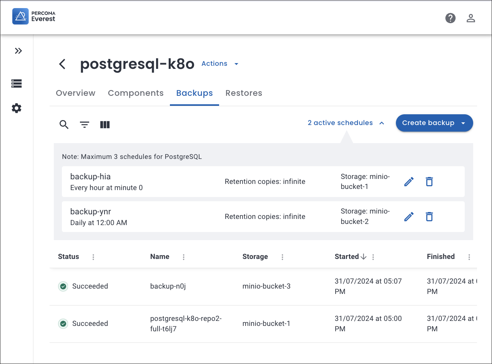
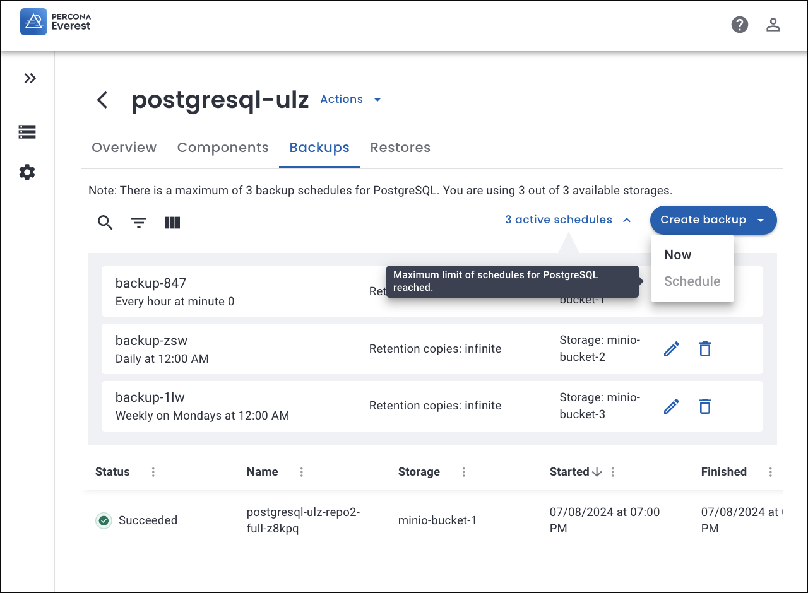

# What's new in Percona Everest 1.1.0

To begin your journey with Percona Everest, check out the [Quickstart Guide for Percona Everest](../quickstart-guide/quick-install.md).

Percona Everest is an open source cloud native database platform that helps provision and manage databases faster, scale deployments rapidly, and reduce database administration overhead. Plus, you can regain control over your data, database configuration, and DBaaS costs.

Version 1.1.0 introduces the following changes:

## Release highlights

### Enhancements in the functionality for PostgreSQL backups and schedules

We're thrilled to announce that we have enhanced our on-demand backups and schedules to address certain limitations with PostgreSQL. These improvements are designed to offer our users a more seamless experience when utilizing these features.

Check out these improvements:

- If you create more than three backup storages, you can use any existing storages across on-demand backups and schedules as long as the total number of storages in use (by existing on-demand backups and schedules) does not exceed three.
 

    ???+ example "Example"
        If you have created two schedules using backup storage bucket-1 and bucket-2, and an on-demand backup using backup storage bucket-3, you can only utilize one of these three backup storages to create the next on-demand backup or a schedule.

    

    

    

- You can only create up to three backup schedules for PostgreSQL.

    

- You cannot change the storage location in existing schedules.

- You cannot use the same storage location for multiple backup schedules.

## Improvements

- [EVEREST-1259](https://perconadev.atlassian.net/browse/EVEREST-1259) - We have set up a rate limiter to restrict the number of requests you can make to the API within a specific time frame. On the login page, an error will be thrown if you surpass this limit of requests within the given period.

- [EVEREST-1134](https://perconadev.atlassian.net/browse/EVEREST-1134) -Starting with Percona Everest 1.1.0, you now have the convenience of upgrading the database version directly from the Namespaces page, without having to go through the hassle of using the edit DB wizard.

- [EVEREST-1153](https://perconadev.atlassian.net/browse/EVEREST-1153) - We have revamped the CLI UX for install, upgrade, and uninstall commands. Prior to this, the screen was cluttered with logs that were hard to understand. But now, we have made this concise with loading animation and spinners.

- [EVEREST-1088](https://perconadev.atlassian.net/browse/EVEREST-1088) -  We've removed the icons from the **Technology** column in the database list table to make it visually appealing.

- [EVEREST-1196](https://perconadev.atlassian.net/browse/EVEREST-1196) - We've just added a confirmation dialog that pops up when you try to exit the wizard using the side navigation.

- [EVEREST-1070](https://perconadev.atlassian.net/browse/EVEREST-1070) - We've updated the **restore** icon across Percona Everest for a consistent look.

- [EVEREST-247](https://perconadev.atlassian.net/browse/EVEREST-247) - We've updated the Postgresql database icon on the UI for better clarity and visibility.

### Backups and schedules

- [EVEREST-1092](https://perconadev.atlassian.net/browse/EVEREST-1092) - To ensure a seamless user experience, you cannot initiate an on-demand backup while another backup is still in progress.

- [EVEREST-1220](https://perconadev.atlassian.net/browse/EVEREST-1220) -  Starting with Percona Everest 1.1.0, you cannot use more than three different backup storages in total, including those used in existing backup schedules.

- [EVEREST-1071](https://perconadev.atlassian.net/browse/EVEREST-1071)- We've introduced a **deleting** state that will persist until all resources belonging to that backup are removed.

- [EVEREST-1214](https://perconadev.atlassian.net/browse/EVEREST-1214) - We've made it easier to manage backup schedules by removing the restriction on deleting PostreSQL schedules.

- [EVEREST-1223](https://perconadev.atlassian.net/browse/EVEREST-1223) - Starting with Percona Everest 1.1.0, you cannot edit the region and bucket for the existing backup storage.

- [EVEREST-1226](https://perconadev.atlassian.net/browse/EVEREST-1226) - Starting with Percona Everest 1.1.0, you cannot create backup storages with the same bucket, region, and URL. 

- [EVEREST-1229](https://perconadev.atlassian.net/browse/EVEREST-1229) - For an enhanced user experience, you can now view the backup storage being utilized for both on-demand backups and schedules.

## Bugs fixed

- [EVEREST-1233](https://perconadev.atlassian.net/browse/EVEREST-1233) - Fixed an issue where an incorrect error message was displayed when attempting to downgrade a major database version.

- [EVEREST-740](https://perconadev.atlassian.net/browse/EVEREST-740) - We fixed an issue where MySQL was not selected as the default database engine when creating a database, specifically when it was not the first operator installed.

- [EVEREST-1181](https://perconadev.atlassian.net/browse/EVEREST-1181) - Database engine major version upgrade was not possible for MongoDB and PostgreSQL, so it should have been disabled in database edit. However, it was enabled. We have addressed this issue, and it is disabled now.

- [EVEREST-859](https://perconadev.atlassian.net/browse/EVEREST-859) - While uninstalling Percona Everest, an error was thrown during namespace deletion. The issue has been resolved now.

- [EVEREST-1074](https://perconadev.atlassian.net/browse/EVEREST-1074) - The performance of the backup page was affected while adding and editing the backups. The issue has been resolved now.

- [EVEREST-1141](https://perconadev.atlassian.net/browse/EVEREST-1141) - The backup files stored in the S3 bucket were not removed even after the corresponding database was deleted.  The issue has been resolved now.

- [EVEREST-1144](https://perconadev.atlassian.net/browse/EVEREST-1144) - While editing the backup storage in a PostgreSQL database backup schedule, an error was encountered after three backup schedules were created. The issue has been resolved now.

- [EVEREST-910](https://perconadev.atlassian.net/browse/EVEREST-910) - The schedule name and storage location for scheduled backups were not visible on the UI. The issue has been resolved now.

- [EVEREST-1050](https://perconadev.atlassian.net/browse/EVEREST-1050) - Fixed an issue that was preventing the restore information from being updated on the restore page. 

- [EVEREST-1244](https://perconadev.atlassian.net/browse/EVEREST-1244) - While attempting to restore a database, there was a discrepancy between the messages indicating the status of the restoration process and the actual actions being taken by Percona Everest. The issue has been resolved now.

- [EVEREST-1204](https://perconadev.atlassian.net/browse/EVEREST-1204) - Before, when creating a database from the UI, it used `G` as the unit for storage instead of `Gi`. It also used `G` when displaying details about the database storage. The issue has been resolved now, and it shows the correct unit.

- [EVEREST-307](https://perconadev.atlassian.net/browse/EVEREST-307) - We have fixed an issue where the errors contained exceptions and stack traces.

