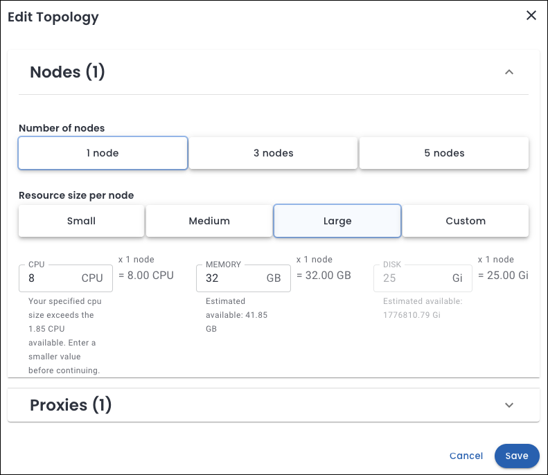

# Scaling your database deployment

Scaling in Percona Everest allows for easy adjustment of database capacity and performance to meet the changing demands.

* Vertical scaling
            
    Vertical scaling is essential for addressing increased workloads or performance demands. You can scale up or scale down as per your requirements. 
        
    * Scale up

        You can vertically scale up your Percona Everest instance by modifying its configuration to a higher performance tier. This involves increasing the memory and/or CPU threshold. To increase the performance of your cluster, you can create a cluster with bigger disk size and memory that can hold more data.
        
        **Example**
        For optimal cluster performance, select **Large** as the **Resource size per node** when creating a database cluster. It has higher preset thresholds for CPU, memory, and disk as comapared to **Small**.
            
        

    * Scale down 

        Similarly, you can scale down (downsize) your database instance when the resource requirements decrease, which can help optimize costs.
            
        **Example**
      If performance is not a criteria and resource requirements are low, opt for **Small** as the **Resource size per node** when creating a database cluster. This option has lower preset thresholds for CPU, Memory, and Disk compared to the **Large**.
        
        

* Horizontal scaling

    To scale Percona Everest horizontally, add database nodes to the existing cluster. These nodes share the workload, distributing queries and transactions more evenly, which can lead to improved performance as well as availability and datbaase resilience.

    

