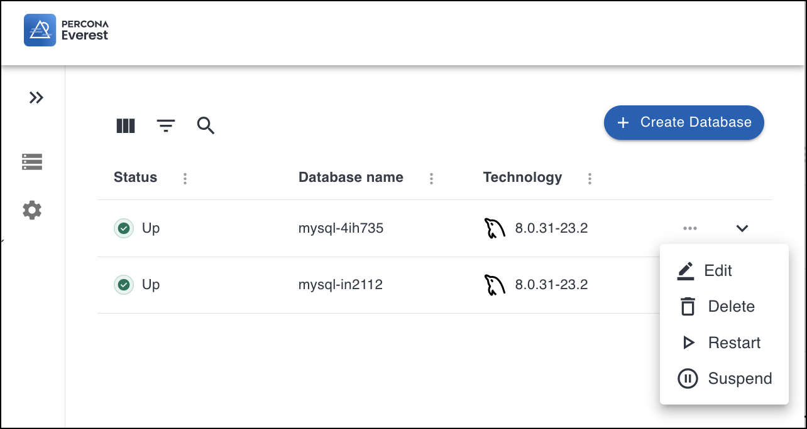
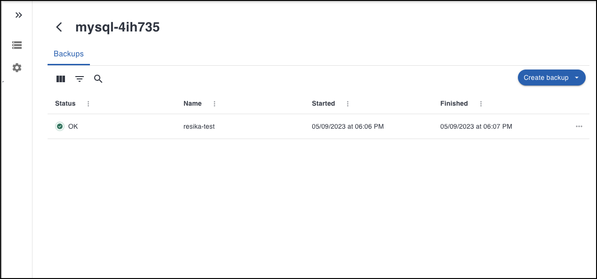

# Manage clusters

Cluster management involves the administration and maintenance of database clusters. Here's an overview of Percona Everest cluster management.
{.power-number}

1. [Database provisioning](../use/db_provision.md)
    
    Provisioning a database instance involves setting up and configuring a database instance on the Perona Everest platform. 

    

2. Editing the database clusters

    Editing a cluster in a Percona Everest environment typically involves making configuration changes to an existing database cluster to adapt it to your evolving needs. 

    

3. [Scaling](../use/scaling.md)

    Scaling in Percona Everest involves adjusting the capacity and performance of your database instances to meet changing application demands. You can scale Percona Everest vertically and horizontally.

    

    * Vertical scaling
            
        Vertical scaling is essential for addressing increased workloads or performance demands. You can scale up or scale down as per your requirements. 
        
        * Scale up

            You can vertically scale up your Percona Everest instance by modifying its configuration to a higher performance tier. This involves increasing the memory and/or CPU threshold.

        * Scale down               
        
            Similarly, you can scale down (downsize) your database instance when the resource requirements decrease, which can help optimize costs.

    * Horizontal scaling

        To scale Percona Everest horizontally, add database nodes to the existing cluster. These nodes share the workload, distributing queries and transactions more evenly, which can lead to improved performance.

4. [Back up and restore](../use/AboutBackups.md)

Back up and restore are critical aspects of managing and maintaining databases in Percona Everest. Implementing robust backup and recovery strategies is crucial for preserving the integrity and availability of data and ensuring seamless business operations.

With the Percona Everest platform,  you can generate backups on demand, create new databases using pre-existing backups, and restore backups to existing database clusters.

4. [Monitoring](../use/monitor_endpoints.md)

Monitoring ensures consistent performance by continuously observing various metrics and aspects of the database system. It helps identify performance issues or bottlenecks before they escalate, allowing timely interventions, optimizations, and resource allocation adjustments. This helps us maintain a stable and consistent database system performance over time.

