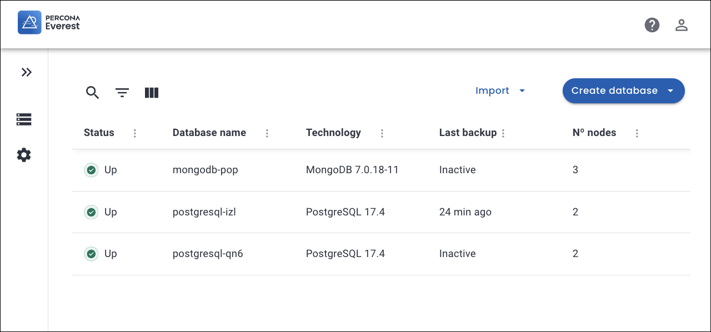

# Database view

The database view in Percona Everest provides an interface to view and provision your databases. With the database view, you can keep a close eye on all your databases and their status and perform tasks such as backup and restore.

    

Click on the individual database, and you can perform the following actions:

- **Edit the database**
    
    To edit any parameters for your database, click the ellipsis (...) menu next to the database you want to edit, then click **Edit**. Make the required changes on the screens that follow and then click *Edit database*.

-  **Restart the database**

    Restarting your database can improve the performance of your database and enable you to apply recent configuration changes. To restart your database, click the ellipsis (...) menu next to the database you want to restart, then click **Restart**. 

- **Create database from a backup**

    You can create a database from a backup with Percona Everest. To create a backup, click the ellipsis (...) menu next to the database, then click **Create database from a backup**. For detailed information see, the [create a database from a backup ](createBackups/create_new_database.md) section.

- **Restore database from a backup**

    You can restore a database with Percona Everest. To restore your database, click the ellipsis (...) menu next to the database, then click **Restore database from a backup**. For detailed information see, the [restore a database from a backup](createBackups/RestoreBackup.md) section.

- **Suspend the database**

    Suspending your database can save resources when it's not being used. Pausing it can also conserve CPU and memory. To suspend your database, click the ellipsis (...) menu next to the database you want to suspend, then click **Suspend**. To resume your database click **Resume**. You database will be immediately resumed.

- **Delete the database**

    When you dont need the database anymore, you can delete the database. To delete your database, click the ellipsis (...) menu next to the database you want to suspend, then click **Delete**.

