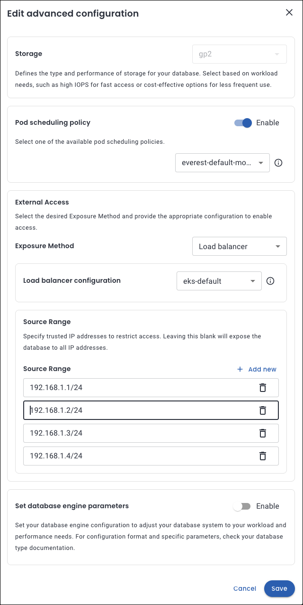

# Configure database engine 

Percona Everest provides configuration settings and options, which are essential for tailoring the database behavior and performance to meet the needs of various applications. You can fine-tune your database operations using these settings and options, thus increasing efficiency and productivity.

## Configure database engine for new DB cluster

To configure your database engine in Percona Everest:
{.power-number}

1. From the Percona Everest main page, navigate to **Create database > Advanced Configurations** page.

2. Select the **Exposure Method** as either **Cluster IP** or **Load balancer**.

    !!! note alert alert-primary "Note"
        - Enabling remote access to your database can lead to serious security risks such as unauthorized access, data breaches, and compliance violations.
        - The network mask is always required, so if you want to limit access to a single IP, ensure to add the `/32` network mask.

    
    

3. If you selected **Load balancer** in the previous step, click **Add new** to add the IP addresses in the **Source Range** field.

4. You can optimize your database's performance using **Database Engine Parameters** on the **Advanced configurations** page.
5. Enable Database engine parameters by using the toggle.
6. Configure specific values to optimize performance, security, and functionality according to your requirements by entering the values in the text box.

    

    Here are some configuration examples for each supported engine type:

    **MySQL** 
    <pre><code>[mysqld]
    key_buffer_size=16M
    max_allowed_packet=128M
    max_connections=250</pre></code>

    **Mongo**
    <pre><code>operationProfiling:
      mode: slowOp
      slowOpThresholdMs: 200</pre></code>

    **PostgreSQL**
    <pre><code>log_connections = yes
    search_path = '"$user", public'
    shared_buffers = 128MB</pre></code>

    For more information on configuring specific database parameters, see the [MySQL](https://dev.mysql.com/doc/refman/8.0/en/option-files.html){:target="_blank"}, [MongoDB](https://www.mongodb.com/docs/manual/reference/configuration-options/){:target="_blank"}, and [PostgreSQL](https://www.postgresql.org/docs/current/config-setting.html#CONFIG-SETTING-CONFIGURATION-FILE){:target="_blank"} configuration documentation.

7. Click **Continue** till you reach the end of the wizard.

8. Click **Create database**. The database engine parameters will be updated.

## Configure database engine for an existing DB cluster

To update your database engine in Percona Everest for an existing DB cluster:
{.power-number}

1. Go to the Percona Everest home page and click on the database for which you want to update the database engine. The **Overview** page will be displayed.

2. On the **Advanced configuration** widget, click **Edit**. The **Edit advanced configuration** screen will be displayed.

    

3. Make the necessary changes and then click **Save**. The database engine parameters will be updated.
