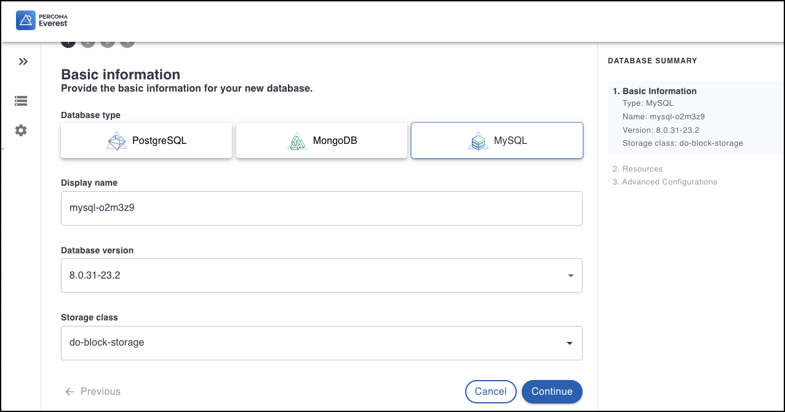
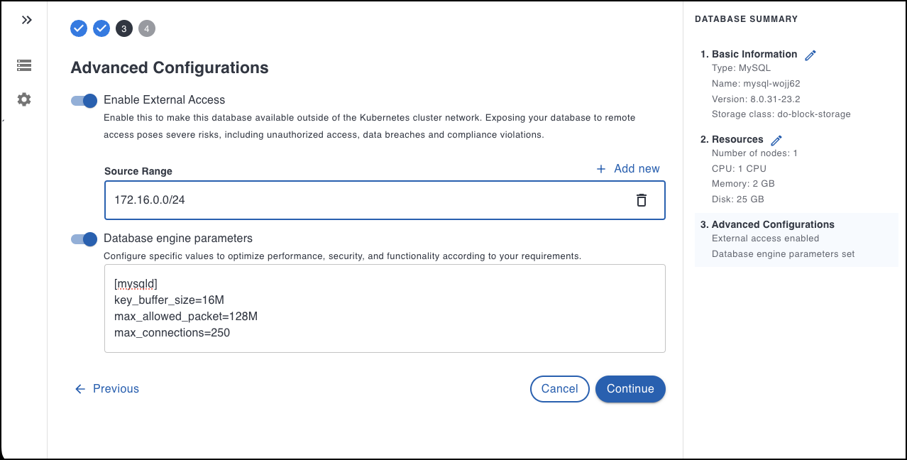

# Provision a database

Provisioning a database instance involves setting up and configuring a database instance on the Percona Everest platform. 

The steps to provision a new database are:
{.power-number}

1. Log into the Percona Everest UI. 

    The Percona Everest homepage will be displayed.

2. Click **Create Database**.

    

    The Basic information page will be displayed.

3. Select the **Database type**: PostgreSQL, MySQL, or MongoDB.

    

4. Choose a name for your database. The name is auto-populated, but you can modify it according to your needs.

5. Select the **Database version** from the dropdown.

6. In the **Storage class** field, select one of the classes created by your Kubernetes administrator. Storage classes define what storage configuration and features will be used for storing your database data. Different classes map to different quality-of-service levels, backup policies, persistent volumes, or to arbitrary policies determined by your cluster administrator. For more information, see [Storage Classes](https://kubernetes.io/docs/concepts/storage/storage-classes/) in the Kubernetes documentation. 

7. Click **Continue**.

    The **Resources** page will be displayed.

8.  Select the **Number of nodes**. Also, set the resources per node by selecting one of the predefined presets or by specifying the CPU, Memory, and Disk. For more information on resources, see the [topic]().

    

9.  Click **Continue**. 

    The **Advanced Configurations** page will be displayed.

10. On the **Advanced Configurations** page, you can enable external access and database engine parameters by turning the toggle button on.

    
11. If you’ve enabled monitoring during CLI provisioning, the Monitoring option will show as active on the last page of the wizard, and you can disable it if required.

12. Click **Create Database**. Your database will be created.
    
13. Click **Go to list of my databases**. You will see the database that you provisioned.

    
