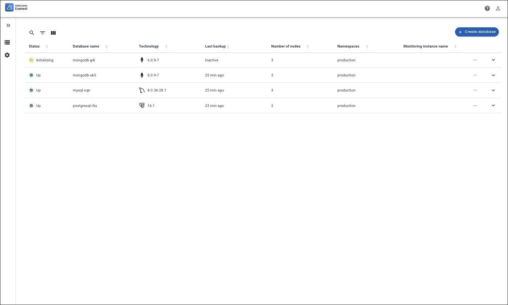

# Provision a database

Provisioning a database instance involves setting up and configuring a database instance on the Percona Everest platform.

## Video tutorial

Learn about creating databases and backups by checking the instructions under this topic or by following the video tutorial below.

<iframe width="560" height="315" src="https://www.youtube.com/embed/vxhNon-el9Q?si=8toRQZ-Z1-prU9vC" title="YouTube video player" frameborder="0" allow="accelerometer; autoplay; clipboard-write; encrypted-media; gyroscope; picture-in-picture; web-share" allowfullscreen></iframe>   

## Procedure

To provision a new database:
{.power-number}

1. Log into the Percona Everest UI.

2. On the Percona Everest homepage, click **Create Database** to display the Basic information page:

    

3. Select the **Database type**: PostgreSQL, MySQL, or MongoDB.

4. Choose a name for your database. The name is auto-populated, but you can modify it according to your needs.

5. Select the **Database version** from the dropdown.

6. In the **Storage class** field, select one of the classes created by your Kubernetes administrator. Storage classes define what storage configuration and features will be used for storing your database data. Different classes map to different quality-of-service levels, backup policies, persistent volumes, or to arbitrary policies determined by your cluster administrator. For more information, see [Storage Classes](https://kubernetes.io/docs/concepts/storage/storage-classes/){:target="_blank"} in the Kubernetes documentation. 

7. Click **Continue** to go to the **Resources** page.

8. Select the **Number of nodes**. Also, set the resources per node by selecting one of the predefined presets or by specifying the CPU, Memory, and Disk. For more information on resources, see the [Scale database deployment](../use/scaling.md).

9. Click **Continue** to navigate to the **Backups** page where you can set up a schedule and specify a storage location if you wish to run backup jobs for your new database.

10. On the **Advanced Configurations** page, you can enable external access and database engine parameters by turning the toggle button on.

11. If you’ve enabled monitoring during CLI provisioning, the **Monitoring** option will show as active on the last page of the wizard, and you can disable it if required.

12. Click **Create Database**.

13. Click **Go to list of my databases** to see the database that you provisioned.

    
