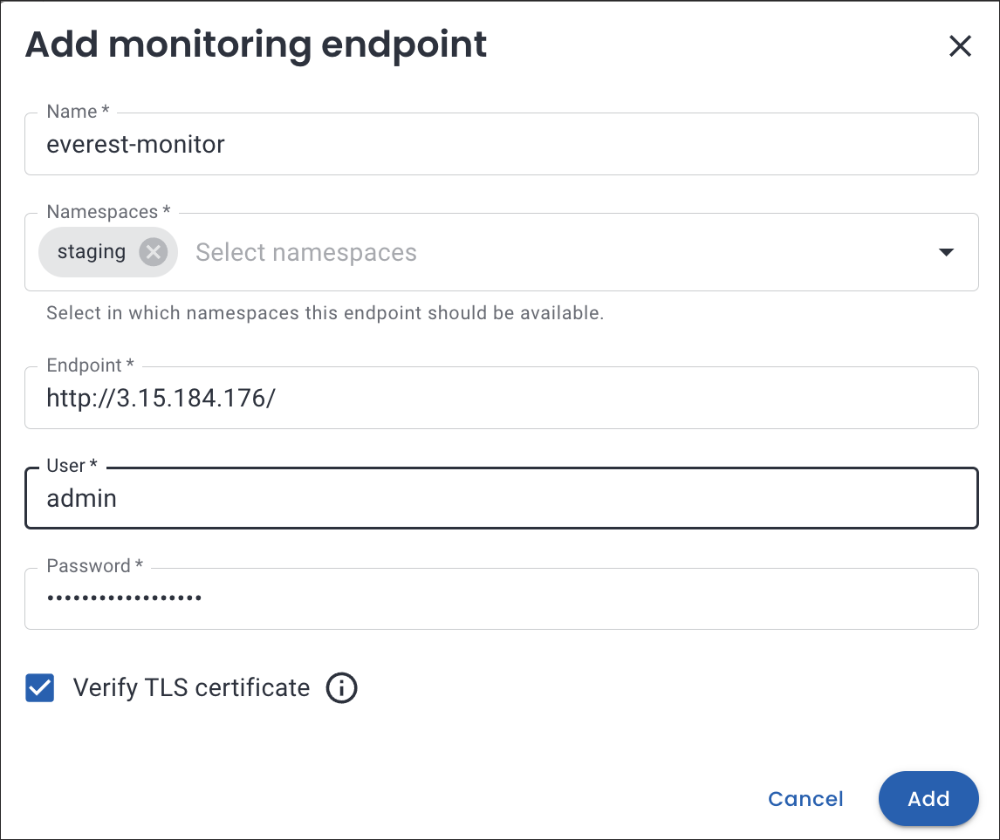

# Monitoring

Percona Everest provides monitoring capabilities with PMM to maintain a reliable and secure database infrastructure.

Here are some key benefits you'll get with monitoring of Percona Everest:

- Database availability and uptime tracking
- Insights into your database performance
- Proactive issue detection and addressing opportunities
- Continuous monitoring

## Prerequisites

To use monitoring in Percona Everest, you should have a PMM instance up and running.

For information on installing PMM, see the [documentation](https://docs.percona.com/percona-monitoring-and-management/setting-up/index.html).

## Add monitoring from the UI

!!! warning "Important"
    When setting up DB cluster monitoring, using endpoints added through the user interface will result in a limited selection of metrics being sent to PMM. To receive the full range of metrics (including k8s data points), configure monitoring endpoints using the [Everest CLI](../install/installEverestCLI.md) `everestctl monitoring enable` command.

To add monitoring in Percona Everest from the UI:
{.power-number}

1. From the Percona Everest Homepage, navigate to <i class="uil uil-cog"></i> **Settings > Monitoring endpoints**. The **Add monitoring endpoint** dialogue box opens.

2. On the **Add monitoring endpoint screen**, enter a PMM instance name. In the **User** and **Password** field, enter the credentials received upon installing PMM. In the **Endpoint** field, enter the PMM URL.

    

## Edit monitoring from the UI

To edit a monitoring endpoint from Percona Everest UI:
{.power-number}

1. From the Percona Everest Homepage, navigate to <i class="uil uil-cog"></i> **Settings > Monitoring endpoints**.

2. Click on the ellipsis (three dots) next to the endpoint you need to edit. The **Edit monitoring endpoint** dialogue box opens.

     

3. Click **Add**.

 

