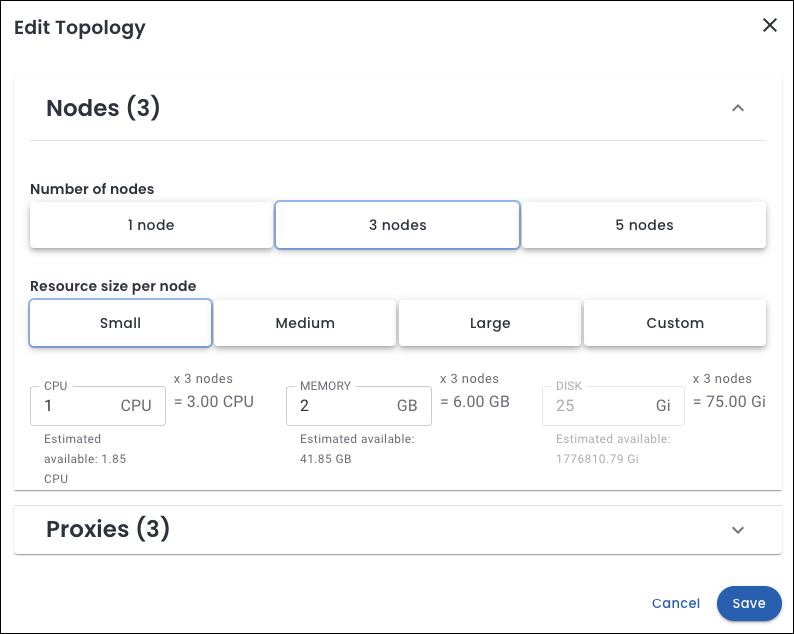

# Scale database deployment

Manual scaling in Percona Everest allows for easy adjustment of database capacity and performance to meet the changing demands.

## Vertical scaling
            
Vertical scaling is essential for addressing increased workloads or performance demands. You can scale up or scale down as per your requirements. 
        
- **Scale up**

    You can vertically scale up your Percona Everest instance by modifying its configuration to a higher performance tier. This involves increasing the memory and/or CPU threshold.       
    
    **Example**
        
    For optimal cluster performance, select **Large** as the **Resource size per node** when creating a database cluster. It has higher preset thresholds for CPU, memory, and disk as compared to **Small**.            
    
    

- **Scale down**

    Similarly, you can scale down (downsize) your database instance when the resource requirements decrease, which can help optimize costs.
            
    **Example**
      
    If performance is not a criterion and resource requirements are low, opt for **Small** as the **Resource size per node** when creating a database cluster. This option has lower preset thresholds for CPU, Memory, and Disk compared to the **Large**.        
    
    

## Horizontal scaling

To scale Percona Everest horizontally, add database nodes to the existing cluster. These nodes share the workload, distributing queries and transactions more evenly, which can lead to improved performance, availability, and database resilience.

## How to scale your database instances

!!! info "Important"

    The allocated resources should be sized based on the expected workload to avoid unexpected restarts of the DB cluster nodes due to under-provisioning.

To scale your database instances:
{.power-number}

1. From the Percona Everest homepage, select the database you wish to scale. The **Overview** page will then be displayed.
2. Navigate to the **Resources** widget and click **Edit**. This will open the **Edit Topology** screen.
3. Select the **Number of nodes**. 
4. Select the **Resources per node**. When selecting the **Resources per node**, the threshold values are automatically populated in the CPU, MEMORY, and DISK fields.
5. Set the **Routers**, **PG Bouncers**, or **Proxies** and their corresponding resources based on the technology used.

6. Click **Save**.

7. Click on expand next to the database that you edited. You can see the resources that you allocated for your database.

    

